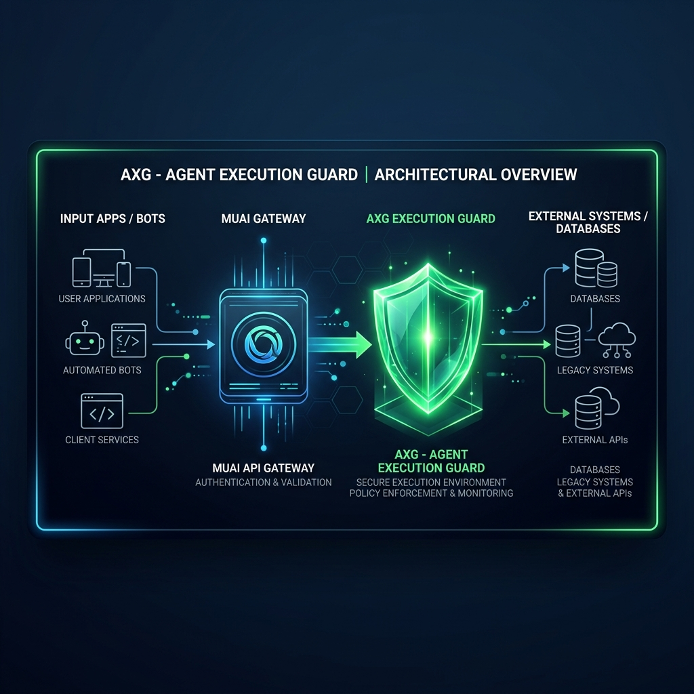

# AXG - Agent Execution Guard


Deterministic execution control for AI agent actions in real systems.

> AI suggests. AXG decides.

AXG sits between probabilistic AI interpretation and deterministic system writes. It evaluates risk, uncertainty, and policy constraints before any action is allowed to execute.

## Status: 10/10 Production Ready

AXG has reached **10/10 technical maturity** (Stabilization 2.0). It is currently used as the trust layer for high-stakes enterprise AI orchestration, ensuring safety and compliance across the MUAI ecosystem.

## Why AXG Exists

AI agents are probabilistic by nature. Production systems are not.

AXG is designed to prevent blind automation by enforcing deterministic decisions:

- **ALLOW**: safe to execute automatically
- **SUGGEST**: provide recommendation but avoid silent execution
- **CONFIRM**: require explicit human confirmation
- **BLOCK**: deny execution based on policy/permission

## How AXG Fits In



In the broader ecosystem, MUAI is the gateway for AI capabilities and model fallback. AXG remains the deterministic gate before writes, external actions, or operational truth updates.

**MUAI LLM Gateway Synergy**: AXG is fully integrated with MUAI's LLM Gateway, ensuring that model-agnostic capabilities are governed by centralized security and risk policies.

Execution flow:

```text
App/Bot/Tool -> MUAI (intent + capabilities) -> AXG (execution guard) -> Core system write path
```

## What AXG Is (and Is Not)

AXG **is**:
- a deterministic execution control plane
- a policy/risk decision engine
- a cryptographic trust layer for autonomous actions (via AXG Passport)
- an auditable guardrail layer for production workflows

AXG is **not**:
- an LLM wrapper
- a prompt orchestration framework
- an autonomous agent framework

## Core Capabilities

- **Context Validation**: Validates `app_id`, `plugin_id`, source, and action.
- **Agent Identity**: Supports agent identity and permission-based authorization.
- **Declarative Rules**: Applies rules (`plugins/<plugin_id>/rules.json`) without dynamic code execution.
- **Deterministic Scoring**: Computes `llm_confidence`, `final_confidence`, `risk_score`, and `uncertainty_score`.
- **AXG Passport**: Issues short-lived RS256 signed `passport` for `ALLOW` decisions.
- **Payload Integrity**: Mandatory SHA-256 hashing of actionable payloads to prevent tampering.
- **Public Verification**: Exposes public keys through `/v1/certs`.
- **Audit Sinks**: Structured logging, file (`JSONL`), and webhook audit sinks.
- **CLI**: Tool for plugin validation and local decision simulation.

## AXG Passport

AXG Passport makes AXG a cryptographic trust layer. When AXG returns an `ALLOW` decision, it includes a short-lived JWT `passport` signed with RS256.

Consumer systems (e.g., FinNorte, Social Intent) verify this token before trusting an AI-proposed action. The token binds the authorized action to a deterministic hash of the payload, preventing tampering or unauthorized modification.

### Passport Flow

```text
Agent / Bot / App
  -> MUAI interprets intent
  -> AXG evaluates policy and signs ALLOW decisions
  -> Consumer backend verifies Passport token
  -> System writes only if verification passes
```

## Decision Flow (Deterministic)

1. Load plugin by `plugin_id`.
2. Evaluate declarative rules against request data.
3. Compute confidence/risk/uncertainty scores.
4. Apply fail-safe uncertainty gate for risky financial writes.
5. Enforce action permissions.
6. Apply strongest rule decision by precedence.
7. Fallback to threshold-based decision when no rule applies.
8. Sign the actionable payload for `ALLOW` decisions (RS256).

Decision precedence:
`BLOCK > CONFIRM > SUGGEST > ALLOW`

## API

- `GET /health`: Health check.
- `POST /v1/decisions`: Main decision engine endpoint.
- `GET /v1/certs`: Public key material for Passport verification.
- `POST /v1/plugins/reload`: Administrative plugin reload (requires `AXG_ADMIN_TOKEN`).

### Example Request

```json
{
  "execution_id": "exec_001",
  "tenant_id": "tenant_001",
  "app_id": "finnorte",
  "plugin_id": "finnorte",
  "agent": {
    "id": "muai_whatsapp",
    "type": "service",
    "permissions": ["expense:create"]
  },
  "source": "whatsapp",
  "action_type": "create_expense",
  "payload": {
    "merchant": "Uber",
    "amount": 1500,
    "currency": "EUR",
    "proposed_action": "create_expense",
    "proposed_category": "Transport"
  },
  "context": {},
  "llm": {
    "model": "llama-3.3-70b",
    "confidence": 0.78,
    "raw_output": {}
  },
  "intent": {
    "original": "create_expense",
    "resolved": "create_expense",
    "fallback_used": false
  },
  "metadata": {
    "tenant_id": "tenant_001",
    "flow": "bot_expense_validation"
  }
}
```

### Example Response

```json
{
  "schema_version": "axg.decision_response.v1",
  "execution_id": "exec_001",
  "plugin_version": "finnorte@0.1.0",
  "decision": "CONFIRM",
  "passport": "eyJhbGciOiJSUzI1NiIs...",
  "scores": {
    "llm_confidence": 0.78,
    "final_confidence": 0.48,
    "risk_score": 0.9,
    "uncertainty_score": 0.0
  },
  "actionable_payload": {
    "proposed_action": "create_expense",
    "merchant": "Uber",
    "amount": 1500,
    "currency": "EUR",
    "suggested_category": "Transport"
  },
  "reason": "This transaction has a high financial value and requires user confirmation before saving. This Uber expense is significantly higher than the user's normal Uber and transport spending patterns. Please confirm before saving.",
  "audit_flags": [
    "high_value_transaction",
    "requires_user_confirmation",
    "merchant_amount_anomaly"
  ],
  "rules_triggered": [
    {
      "id": "high_value_transaction",
      "decision": "CONFIRM",
      "reason": "This transaction has a high financial value and requires user confirmation before saving."
    },
    {
      "id": "merchant_amount_anomaly",
      "decision": "CONFIRM",
      "reason": "This Uber expense is significantly higher than the user's normal Uber and transport spending patterns. Please confirm before saving."
    }
  ],
  "metadata": {
    "tenant_id": "tenant_001",
    "flow": "bot_expense_validation"
  }
}
```

## Plugin Model

Plugins are JSON-only policies. Path: `plugins/<plugin_id>/rules.json`

## CLI

AXG ships with a CLI for local validation and simulation.

```bash
# Validate a plugin
axg validate-plugin --id finnorte --dir plugins

# Simulate a decision
axg simulate-decision --plugin finnorte --payload ./examples/request.json --dir plugins
```

## Project Structure

```text
axg/
  api.py              # FastAPI app and request/response logging
  audit.py            # file/webhook audit sinks
  cli.py              # plugin validation and decision simulation CLI
  crypto.py           # RS256 Passport token signing and payload hashing
  engine.py           # deterministic decision orchestration
  models.py           # Pydantic schemas and enums
  plugin_loader.py    # plugin loading + schema validation
  rules.py            # rule operator evaluation
plugins/
  finnorte/
    rules.json        # FinNorte domain policy
tests/
  test_audit.py       # audit sink tests
  test_axg_core.py    # engine + API tests
  test_cli.py         # CLI tests
  test_crypto.py      # Passport crypto tests
```

## Fail-Safe Principles

- **Never fail open** to `ALLOW` on plugin/config issues.
- Unknown/high-uncertainty financial writes require confirmation.
- Permission failures produce deterministic `BLOCK`.
- Signing failures produce deterministic `CONFIRM` or safer.
- Admin operations fail closed when not configured.
- Every decision includes machine-readable and human-readable audit context.

## Local Development

```bash
pip install -e ".[test]"
python -m pytest --cov=axg --cov-report=term-missing --cov-fail-under=98
python -m uvicorn axg.api:app --reload
```

## License

Apache-2.0
