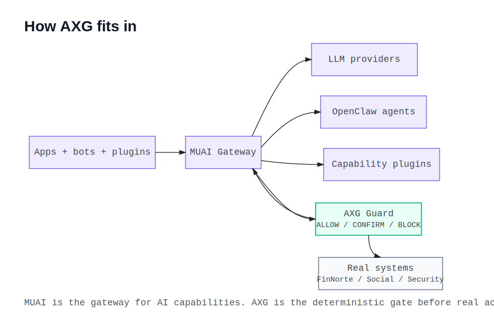

# AXG - Agent Execution Guard

Deterministic execution control for AI agent actions in real systems.

> AI suggests. AXG decides.

AXG sits between probabilistic AI interpretation and deterministic system writes. It evaluates risk, uncertainty, and policy constraints before any action is allowed to execute.

## Why AXG Exists

AI agents are probabilistic by nature. Production systems are not.

AXG is designed to prevent blind automation by enforcing deterministic decisions:

- **ALLOW**: safe to execute automatically
- **SUGGEST**: provide recommendation but avoid silent execution
- **CONFIRM**: require explicit human confirmation
- **BLOCK**: deny execution based on policy/permission

This pattern helps teams safely adopt AI in financial and operational workflows where mistakes are expensive.

## Architecture Overview



In the broader ecosystem, MUAI is the gateway for AI capabilities and model fallback. OpenClaw can run as an agent capability behind MUAI, but it does not execute real-world changes directly. AXG remains the deterministic gate before writes, external actions, or operational truth updates.

Execution flow:

```text
App/Bot/Tool -> MUAI (intent + capabilities) -> AXG (execution guard) -> Core system write path
```

Conceptually, AXG is the policy and risk gate between intent understanding and persistence/actions.

## What AXG Is (and Is Not)

AXG **is**:

- a deterministic execution control plane
- a policy/risk decision engine
- an auditable guardrail layer for production workflows

AXG is **not**:

- an LLM wrapper
- a prompt orchestration framework
- an autonomous agent framework
- a learning/retraining system

## Core Capabilities

- Validates execution context (`app_id`, `plugin_id`, source, action).
- Supports agent identity and permission-based authorization.
- Applies declarative plugin rules (`plugins/<plugin_id>/rules.json`) with no dynamic code execution.
- Issues short-lived cryptographic Decision Tokens for `ALLOW` decisions.
- Exposes public verification material through `/v1/certs`.
- Supports file and webhook audit sinks for external audit pipelines.
- Provides a CLI for plugin validation and local decision simulation.
- Computes deterministic scoring:
  - `llm_confidence`
  - `final_confidence` (after penalties)
  - `risk_score`
  - `uncertainty_score`
- Handles uncertain intent/fallback paths safely for financial write operations.
- Returns a structured decision with:
  - human-readable reason
  - actionable payload
  - audit flags
  - triggered rules
- Emits structured logs for request/decision tracing.
- Fails safe to `CONFIRM` if plugin loading/validation fails.
- Fails safe to `CONFIRM` if decision token signing fails.

## AXG Passport

AXG Passport is the first step toward making AXG a cryptographic trust layer for autonomous actions.

The goal is to reduce client-side bypass:

> AXG evaluates and signs. The consumer backend verifies before execution.

When AXG returns an `ALLOW` decision, it can include a short-lived JWT `decision_token` signed with RS256. Consumer systems, such as FinNorte, validate that token before trusting an AI-proposed action.

The token includes:

- `iss`: AXG issuer (`axg-engine`)
- `sub`: execution id
- `aud`: target app/consumer
- `iat` and `exp`: short TTL to reduce replay risk
- `decision`: expected to be `ALLOW` for automatic execution
- `action_type`: the authorized action
- `payload_hash`: deterministic SHA-256 hash of the actionable payload

This means a token approved for a 15 EUR Uber expense cannot be reused to persist a 1500 EUR transaction or a different action type.

### Passport Flow

```text
Agent / Bot / App
  -> MUAI interprets intent
  -> AXG evaluates policy and signs ALLOW decisions
  -> Consumer backend verifies Passport token
  -> System writes only if verification passes
```

Current FinNorte integration runs Passport verification in shadow mode for bank import categorization. Shadow mode validates and logs the token without blocking production writes yet. This lets the system prove reliability before moving to hard enforcement.

### Key Management

AXG uses asymmetric keys:

- `AXG_PRIVATE_KEY`: only AXG uses this to sign decision tokens.
- `AXG_PUBLIC_KEY`: consumers use this to verify decision tokens.

Both values support escaped newlines (`\n`) for `.env` and GitHub Actions secrets.

If no keys are configured, AXG generates ephemeral local-development keys at startup. This is useful for tests and local demos, but production should always inject stable rotated keys.

### Fail-Safe Signing

If token signing fails, AXG does not return an automatic `ALLOW`.

Instead it:

- returns `decision_token: null`;
- downgrades the decision to `CONFIRM` when needed;
- adds `decision_token_signing_failed` to `audit_flags`;
- returns a human-readable reason explaining that automatic execution cannot be authorized.

## Decision Flow (Deterministic)

1. Load plugin by `plugin_id`.
2. Evaluate declarative rules against request data.
3. Compute confidence/risk/uncertainty scores.
4. Apply fail-safe uncertainty gate for risky financial writes.
5. Enforce action permissions.
6. Apply strongest rule decision by precedence.
7. Fallback to threshold-based decision when no rule applies.
8. Sign the actionable payload when the final decision can be automatically authorized.

Decision precedence:

```text
BLOCK > CONFIRM > SUGGEST > ALLOW
```

## API

Start locally:

```bash
python -m uvicorn axg.api:app --reload
```

Endpoints:

- `GET /health`
- `POST /v1/decisions`
- `GET /v1/certs`
- `POST /v1/plugins/reload`

`/v1/plugins/reload` is an administrative endpoint. It fails closed unless `AXG_ADMIN_TOKEN` is configured and the caller sends `Authorization: Bearer <token>`.

### Example Request

```json
{
  "execution_id": "exec_001",
  "app_id": "finnorte",
  "plugin_id": "finnorte",
  "agent": {
    "id": "muai_whatsapp",
    "type": "service",
    "permissions": ["expense:create"]
  },
  "source": "whatsapp",
  "action_type": "create_expense",
  "payload": {
    "merchant": "Uber",
    "amount": 1500,
    "currency": "EUR",
    "proposed_action": "create_expense",
    "proposed_category": "Transport"
  },
  "context": {},
  "llm": {
    "model": "llama-3.3-70b",
    "confidence": 0.78,
    "raw_output": {}
  },
  "intent": {
    "original": "create_expense",
    "resolved": "create_expense",
    "fallback_used": false
  },
  "metadata": {
    "tenant_id": "tenant_001",
    "flow": "bot_expense_validation"
  }
}
```

### Example Response

```json
{
  "schema_version": "axg.decision.v1",
  "execution_id": "exec_001",
  "plugin_version": "finnorte@0.1.0",
  "decision": "CONFIRM",
  "decision_token": null,
  "scores": {
    "llm_confidence": 0.78,
    "final_confidence": 0.48,
    "risk_score": 0.9,
    "uncertainty_score": 0.0
  },
  "actionable_payload": {
    "proposed_action": "create_expense",
    "merchant": "Uber",
    "amount": 1500,
    "currency": "EUR",
    "suggested_category": "Transport"
  },
  "human_readable_reason": "High-value anomaly requires confirmation before execution.",
  "audit_flags": [
    "high_value_transaction",
    "requires_user_confirmation",
    "merchant_amount_anomaly"
  ],
  "rules_triggered": [
    {
      "id": "high_value_transport_anomaly",
      "decision": "CONFIRM",
      "reason": "High value anomaly: this expense is significantly higher than expected and must be confirmed."
    }
  ],
  "metadata": {
    "tenant_id": "tenant_001",
    "flow": "bot_expense_validation"
  }
}
```

### Example Certificate Response

```json
{
  "public_key": "-----BEGIN PUBLIC KEY-----\\n...\\n-----END PUBLIC KEY-----\\n",
  "kid": "axg-key-001",
  "alg": "RS256"
}
```

## Plugin Model

Plugins are JSON-only policies. No plugin runtime code is executed.

Path convention:

```text
plugins/<plugin_id>/rules.json
```

Supported operators:

- `eq`, `neq`
- `gt`, `gte`, `lt`, `lte`
- `in`, `not_in`
- `exists`
- `contains`

Condition groups:

- `all`
- `any`

## CLI

AXG ships with a small CLI for local validation and simulation.

Validate a plugin:

```bash
axg validate-plugin --id finnorte --dir .
```

Simulate a decision:

```bash
axg simulate-decision --plugin finnorte --payload ./examples/request.json --dir .
```

The CLI is intentionally small. It exists to make plugins easier to test before deployment, not to become a full control plane.

## Audit Sinks

AXG always emits structured decision logs. It can also send audit records to optional sinks:

- `AXG_AUDIT_FILE`: append decisions as JSON lines to a local file.
- `AXG_AUDIT_WEBHOOK`: send decisions to an external HTTP endpoint.
- `AXG_AUDIT_WEBHOOK_TOKEN`: optional bearer token for webhook delivery.

Audit delivery runs in the FastAPI background task path and should not block decision latency.

For local webhook testing:

```bash
python scripts/webhook_listener.py --port 9999
```

## Configuration

Important environment variables:

| Variable | Purpose |
| --- | --- |
| `PORT` | API port, defaults to the runtime server configuration. |
| `AXG_PRIVATE_KEY` | RS256 private key used to sign Passport tokens. |
| `AXG_PUBLIC_KEY` | Public key exposed to consumers for verification. |
| `AXG_ADMIN_TOKEN` | Enables authenticated plugin reload. Missing token means reload fails closed. |
| `AXG_AUDIT_FILE` | Optional JSONL audit output path. |
| `AXG_AUDIT_WEBHOOK` | Optional audit webhook URL. |
| `AXG_AUDIT_WEBHOOK_TOKEN` | Optional audit webhook bearer token. |
| `ENABLE_REMOTE_PLUGINS` | Enables HTTP/HTTPS plugin loading. Defaults to `false` for security. |

## Production Validation Scenarios Covered

Current tests and plugin behavior validate these scenarios:

- High-value Uber expense from bot/chat paths -> `CONFIRM`
- Normal expense with sufficient confidence -> `ALLOW`
- Unknown intent + fallback on financial writes -> `CONFIRM`
- Missing intent metadata on uncertain source for financial writes -> `CONFIRM`
- Merchant/category mismatch for subscription-like detection -> `SUGGEST` or `CONFIRM` (never blind `ALLOW`)
- Stable recurring condominium pattern -> `ALLOW`
- Missing permissions for required action -> `BLOCK`
- Unknown action in plugin -> `CONFIRM`
- Missing/invalid plugin -> fail-safe `CONFIRM`
- Passport signing failure -> fail-safe `CONFIRM`
- Private-key-only deployment mode -> public key is derived and verifiable
- Plugin reload without admin token -> fail-closed `401`

## Project Structure

```text
axg/
  api.py              # FastAPI app and request/response logging
  audit.py            # file/webhook audit sinks
  cli.py              # plugin validation and decision simulation CLI
  crypto.py           # RS256 Passport token signing and payload hashing
  engine.py           # deterministic decision orchestration
  models.py           # Pydantic schemas and enums
  plugin_loader.py    # plugin loading + schema validation
  rules.py            # rule operator evaluation
plugins/
  finnorte/
    rules.json        # FinNorte domain policy
scripts/
  webhook_listener.py # local audit webhook lab
tests/
  test_audit.py       # audit sink tests
  test_axg_core.py    # engine + API tests
  test_cli.py         # CLI tests
  test_crypto.py      # Passport crypto tests
```

## Fail-Safe Principles

- **Never fail open** to `ALLOW` on plugin/config issues.
- Unknown/high-uncertainty financial writes require confirmation.
- Permission failures produce deterministic `BLOCK`.
- Signing failures produce deterministic `CONFIRM` or safer.
- Admin operations fail closed when not configured.
- Every decision includes machine-readable and human-readable audit context.

## Local Development

Install dependencies and run tests:

```bash
pip install -e ".[test]"
python -m pytest --cov=axg --cov-report=term-missing --cov-fail-under=100
```

Run API:

```bash
python -m uvicorn axg.api:app --reload
```

## Roadmap

### Phase 1 (implemented)

- Deterministic core decision engine
- FinNorte plugin
- FastAPI decision endpoint
- Structured audit logs
- Unit/API test suite with full package coverage
- AXG Passport JWT signing
- Public cert endpoint
- CLI plugin validation/simulation
- File/webhook audit sinks

### Phase 2 (next)

- Consumer SDKs for Node and Python
- JWKS-style key rotation
- Stronger agent identity and scopes
- Enforcement mode in selected backend write paths

### Phase 3

- Plugin SDK
- Multi-domain plugin catalog
- Hosted audit dashboard

### Phase 4

- AXG Passport spec formalization
- Agentic execution control interoperability profile

## Contributing

Contributions are welcome:

- policy/risk rule improvements
- documentation and examples
- tests and edge-case scenarios
- plugins for new domains

## License

Apache-2.0
