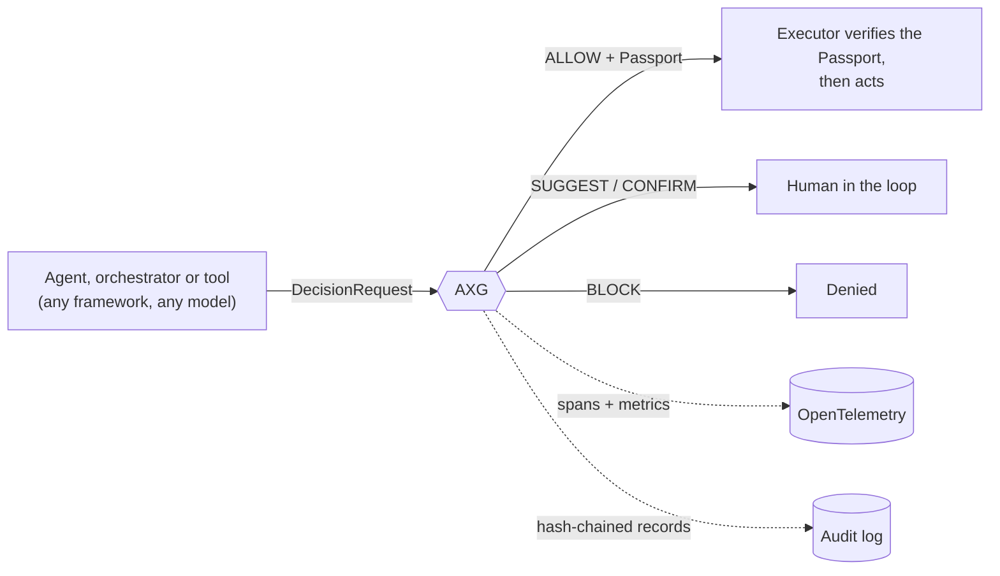

# AXG — Agent Execution Guard


[](https://github.com/pinheirodps/axg/actions/workflows/ci.yml)
[](LICENSE)


**Deterministic, auditable control over what AI agents are allowed to do.**

> AI suggests. AXG decides.

An agent proposes an action (write a record, run a shell command, call a tool). Before anything executes, AXG evaluates it against a declarative policy and answers `ALLOW`, `SUGGEST`, `CONFIRM` or `BLOCK`. An `ALLOW` comes with a signed **Passport** that binds the decision to the exact payload, so the system that executes the action can verify it was authorized and was not changed on the way.

- **Deterministic:** the same request under the same policy always gets the same decision. No model sits in the decision path.
- **Framework-agnostic:** any agent, orchestrator, MCP client or backend calls one HTTP API, or embeds the engine in process.
- **Verifiable:** RS256 Passports with payload hashing, JWKS and single-use `jti`; SDKs for Python and Node.
- **Auditable:** hash-chained audit log and OpenTelemetry traces for every decision.

## Contents

- [How it works](#how-it-works)
- [Quickstart](#quickstart)
- [Integrations](#integrations)
- [Decisions](#decisions)
- [Security](#security)
- [Documentation](#documentation)
- [Status and roadmap](#status-and-roadmap)
- [Contributing](#contributing)

## How it works


```mermaid
flowchart LR
    P["Agent, orchestrator or tool<br/>(any framework, any model)"] -->|DecisionRequest| AXG{{AXG}}
    AXG -->|ALLOW + Passport| X["Executor verifies the Passport,<br/>then acts"]
    AXG -->|SUGGEST / CONFIRM| H[Human in the loop]
    AXG -->|BLOCK| D[Denied]
    AXG -.->|spans + metrics| O[(OpenTelemetry)]
    AXG -.->|hash-chained records| A[(Audit log)]
```

1. The caller authenticates with an API key and sends a `DecisionRequest`: who acts (agent and permissions), what it wants to do (`action_type`, `payload`) and how sure the proposer is (`llm.confidence`).
2. AXG loads the policy plugin, evaluates its rules, enforces agent permissions and computes risk, confidence and uncertainty scores. The strictest outcome wins.
3. `ALLOW` responses carry a Passport. The executor verifies it with an SDK before acting. Everything else carries a human-readable reason and machine-readable audit flags.

AXG never calls a model and never executes the action itself. It is not an LLM wrapper, a prompt framework or an agent framework.

## Quickstart

Run the server with an API key for your app:

```bash
export AXG_KEY=$(openssl rand -hex 32)
export AXG_CLIENTS="[{\"client_id\":\"quickstart\",\"key_sha256\":\"$(python3 -c "import hashlib,os;print(hashlib.sha256(os.environ['AXG_KEY'].encode()).hexdigest())")\",\"app_ids\":[\"*\"],\"permissions\":[\"*\"]}]"

docker run --rm -p 8090:8090 -e AXG_CLIENTS="$AXG_CLIENTS" ghcr.io/pinheirodps/axg:latest
```

Ask for decisions (from a clone of this repository, which provides the example requests):

```bash
# A coding agent wants to read a file: ALLOW, with a Passport
curl -s localhost:8090/v1/decisions -H "Authorization: Bearer $AXG_KEY" \
  -H "Content-Type: application/json" -d @examples/allow.json

# The same agent wants to run `rm -rf /`: BLOCK
curl -s localhost:8090/v1/decisions -H "Authorization: Bearer $AXG_KEY" \
  -H "Content-Type: application/json" -d @examples/block.json
```

```json
{
  "decision": "BLOCK",
  "plugin_version": "claude-code@0.1.0",
  "reason": "This command can irreversibly destroy files or devices.",
  "rules_triggered": [{"id": "destructive_shell_command", "decision": "BLOCK", "reason": "..."}],
  "scores": {"risk_score": 1.0, "risk_level": "high", "final_confidence": 0.49},
  "passport": null
}
```

Or embed the engine in a Python process:

```python
import asyncio
from pathlib import Path

from axg import DecisionEngine, DecisionRequest
from axg.plugin_loader import PluginLoader

engine = DecisionEngine(loader=PluginLoader(Path("plugins")))

async def main():
    decision = await engine.decide(DecisionRequest(
        execution_id="exec-1", tenant_id="acme", app_id="claude-code", plugin_id="claude-code",
        source="coding_agent", action_type="Bash", payload={"command": "git push --force origin main"},
        llm={"confidence": 0.92},
    ))
    print(decision.decision.value, "-", decision.reason)
    # CONFIRM - This Git operation can discard work or rewrite shared history.

asyncio.run(main())
```

Install the current release with `pip install "axg @ git+https://github.com/pinheirodps/axg@v0.3.0"` (add `[otel]` for OpenTelemetry export). PyPI and npm packages are prepared by the release workflow and will be announced in the [changelog](CHANGELOG.md) once uploaded.

## Integrations

| Where your agents run | Integration |
|---|---|
| Any language or framework | HTTP API, plus the [Python](sdks/axg-python-sdk) and [Node](sdks/axg-node-sdk) SDKs to verify Passports |
| MCP servers and tools | `verify_mcp_tool_call` / `verifyMcpToolCall`: a tool checks that AXG authorized exactly the call it received |
| Any MCP server (Streamable HTTP) | [MCP gateway](integrations/mcp_gateway): a proxy that decides every `tools/call`, including human approvals |
| AWS Bedrock AgentCore Gateway | [REQUEST interceptor](integrations/agentcore) (Lambda) that decides before Cedar |
| Microsoft Agent Governance Toolkit | [`IExternalPolicyBackend`](integrations/agt-dotnet) for .NET |
| Claude Code | [`PreToolUse` hook](integrations/claude_code) with a policy for shell and file tools |
| Observability | [OpenTelemetry](docs/observability.md) traces and metrics over OTLP |

Example policies live in [`plugins/`](plugins): `claude-code` (coding agents), `finnorte` (personal finance writes) and `pocket_lawyer` (legal assistant). Write your own with the [policy guide](docs/policies.md).

## Decisions

| Decision | Meaning | Passport |
|---|---|---|
| `ALLOW` | Safe to execute automatically | Yes, for authenticated callers outside shadow mode |
| `SUGGEST` | Show as a recommendation; do not execute silently | After human approval |
| `CONFIRM` | A human must confirm before execution | After human approval |
| `BLOCK` | Denied by policy or missing permission | No |

Precedence is `BLOCK > CONFIRM > SUGGEST > ALLOW`: the strictest applicable outcome wins. `CONFIRM` and `SUGGEST` carry a signed approval ticket: the right person approves, and AXG exchanges the ticket for a single-use Passport, with no state kept in AXG ([human approvals](docs/approvals.md)). Errors never fail open: a policy that cannot be loaded, or a Passport that cannot be signed, results in `CONFIRM`. See [how AXG decides](docs/concepts.md).

## Security

- **Authenticated callers.** API keys, stored as SHA-256, bind each caller to the apps it may request decisions for and cap the permissions it may grant its agents. Anonymous callers are rejected (`401`) or, in migration mode, can never receive `ALLOW`.
- **Passport v2.** A short-lived RS256 JWT with `jti`, `nbf`, tenant, caller (`azp`), policy version and a canonical hash of the whole actionable payload. Keys are published as JWKS, with rotation.
- **Hardening.** Request size limits, per-caller rate limits, no dynamic code in policies, allow-listed remote policies, a hash-chained audit log, pinned dependencies and actions, SBOM and provenance on images.

Read the [security model](docs/security-model.md) before exposing AXG outside a private network. Report vulnerabilities privately as described in [SECURITY.md](SECURITY.md).

## Documentation

| Topic | |
|---|---|
| [Concepts](docs/concepts.md) | Decision flow, scores, uncertainty gate, fail-safe principles |
| [Writing policies](docs/policies.md) | Plugin format, rules and operators, permissions, validation |
| [Human approvals](docs/approvals.md) | Approval tickets, who approves, exchanging a ticket for a Passport |
| [Passport](docs/passport.md) | Claims, verification in Python and Node, replay protection, key rotation, MCP |
| [API and contracts](docs/api.md) | Endpoints, request and response fields, errors, JSON Schemas |
| [Configuration and deployment](docs/configuration.md) | Environment variables, Docker, production checklist |
| [Security model](docs/security-model.md) | Trust boundaries and threat model |
| [Observability](docs/observability.md) | OpenTelemetry spans, events and metrics |
| [Changelog](CHANGELOG.md) | Release notes |

## Status and roadmap

AXG is **beta (v0.3.0)** and runs in production. The API may change before 1.0; breaking changes are versioned in the contracts and listed in the [changelog](CHANGELOG.md).

Next: signed context from trusted providers, an MCP gateway mode, and the first upload of the packages to PyPI and npm.

## Contributing

Contributions are welcome. Start with [CONTRIBUTING.md](CONTRIBUTING.md) and the [code of conduct](CODE_OF_CONDUCT.md). CI requires at least 98% test coverage of the core and integrations.

```bash
pip install -e ".[otel,test]"
python -m pytest --cov=axg --cov=integrations --cov-fail-under=98
python -m uvicorn axg.api:app --reload --port 8090
```

## License

[Apache-2.0](LICENSE)
