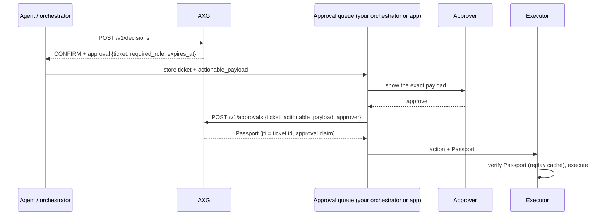

# Human approvals

`CONFIRM` and `SUGGEST` mean "a human must decide". AXG makes that decision verifiable without keeping any state: the decision carries a signed **approval ticket**, the approver's side stores it and shows the payload to the right person, and AXG exchanges an approved ticket for a Passport.



## Why stateless

AXG is a policy decision point. Keeping approvals out of it lets AXG scale horizontally and fit any runtime: the approval queue lives where your agents already keep state (an orchestrator such as MUAI, a LangGraph checkpointer, a workflow engine or a database). Nothing in AXG has to be persisted, replicated or migrated.

## The ticket

A `CONFIRM` or `SUGGEST` returned to an authenticated caller, outside shadow mode, includes:

```json
"approval": {
  "ticket": "eyJhbGciOiJSUzI1NiIsImtpZCI6...",
  "ticket_id": "0b8c…",
  "required_role": "end_user",
  "expires_at": 1790000000
}
```

The ticket is a JWT signed with AXG's Passport key, with header `typ: axg-approval+jwt`. It binds the tenant, app, policy version, action, the SHA-256 of the actionable payload, the required role, the end user and the agent. Its claims are published as [`approval_ticket_claims.v1`](../schemas/approval_ticket_claims.v1.schema.json). A ticket is never a Passport: it carries `CONFIRM`/`SUGGEST`, so Passport verifiers reject it.

Store the ticket and the `actionable_payload` together. Show the approver **the payload itself**, not a model-written summary, because a summary can be steered by prompt injection.

## Who approves

The policy declares the role that must approve:

| Where | Field | Example |
|---|---|---|
| Plugin default | `approval.default_role` (default `end_user`) | Most confirmations are the user's consent |
| Action | `actions.<action>.approver_role` | `delete_account` always needs `tenant_admin` |
| Rule | `rules[].approver_role` | `refund_above_limit` needs `finance_manager` |

The strictest matched rule that names a role wins, then the action, then the plugin default. `approval.ticket_ttl_seconds` (default 3600, from 60 seconds to 7 days) sets how long a ticket stays valid.

This follows common practice for human oversight of AI agents:

- **Consent for personal, reversible actions.** The user the action is for confirms it. With `required_role: end_user`, AXG accepts only the `user_id` of the original request.
- **Separation of duties for high-risk actions.** A second person with an elevated role (maker-checker) approves.
- **An agent never approves its own action.** An approver whose id is the requesting agent's id is refused.

AXG checks roles; your application authenticates the human and asserts their role when it submits the approval. Only callers holding the `approvals:approve` permission in `AXG_CLIENTS` may submit approvals.

## Submitting an outcome

```bash
curl -s https://axg.example.com/v1/approvals -H "Authorization: Bearer $KEY" -H "Content-Type: application/json" -d '{
  "ticket": "<ticket>",
  "actionable_payload": {"amount": 5000, "currency": "EUR", "proposed_action": "create_expense"},
  "approver": {"id": "user-1", "role": "end_user"},
  "outcome": "approve"
}'
```

| Result | Response |
|---|---|
| Approved | `200`: `outcome: approved`, a Passport whose `jti` is the ticket id and whose `approval` claim names the approver, and the payload to execute |
| Denied (`"outcome": "deny"`) | `200`: `outcome: denied`, no Passport |
| Ticket invalid, forged, not a ticket, or expired | `400` |
| Caller not authenticated | `401` (checked before the ticket is read) |
| Caller not allowed for the app, or without `approvals:approve`; wrong role; another user for an `end_user` ticket; the agent itself | `403` |
| Payload differs from the one decided; policy changed or removed since the decision | `409`: request a new decision |
| AXG could not sign | `503`: retry |

Both approvals and denials are written to the audit sinks as [`approval_record.v1`](../schemas/approval_record.v1.schema.json), with the approver and the Passport id.

## Single use without state

A ticket can be submitted more than once, but every Passport it produces has the same `jti`: the ticket id. Executors that verify Passports with a replay cache (`replay_cache` / `replayCache` in the SDKs) accept the first and reject the rest, so one approval authorizes one execution.

## Checklist for the approver's side

- [ ] Store the ticket with the actionable payload, keyed by `ticket_id`; expire entries at `expires_at`.
- [ ] Route the request to someone who holds `required_role`, and authenticate them yourself.
- [ ] Show the exact payload, and submit exactly that payload.
- [ ] Give the Passport to the executor; never execute on `CONFIRM` alone.
- [ ] Verify Passports with a replay cache shared across replicas.
