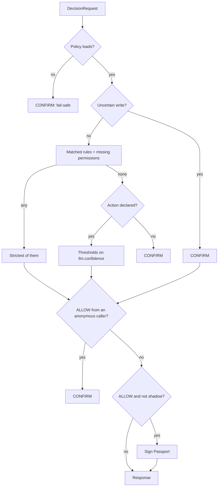

# How AXG decides

AXG turns a proposed action into one of four decisions. The evaluation is deterministic: no model runs inside AXG, and the same request under the same policy version always gets the same decision.

## The request

A `DecisionRequest` describes one proposed action:

| Field | Purpose |
|---|---|
| `execution_id` | Your id for this action. It becomes the Passport subject (`sub`) |
| `tenant_id`, `app_id` | Who the action is for. `app_id` becomes the Passport audience (`aud`) |
| `plugin_id` | The policy to evaluate |
| `agent` | Who acts: `id`, `type` and the `permissions` it holds |
| `source` | The channel the request came from (`api`, `whatsapp_bot`, `coding_agent`…) |
| `action_type`, `payload` | What the agent wants to do, and with which data |
| `llm` | The proposer's `model` and `confidence` (0 to 1) |
| `intent` | Optional intent-resolution details (`original`, `resolved`, `fallback_used`) |
| `context`, `metadata` | Extra data that rules may read |
| `shadow_mode` | Evaluate without authorizing anything (no Passport) |

The full contract is in [API and contracts](api.md).

## Evaluation order

1. **Load the policy.** If the plugin is missing or invalid, the decision is `CONFIRM` with risk 1.0 and the flag `plugin_load_failed`. AXG never fails open.
2. **Uncertainty gate.** If the action is one of the plugin's gated writes and the uncertainty score reaches the gate threshold, the decision is `CONFIRM`.
3. **Rules and permissions.** Every matching rule contributes its decision. If the agent lacks a permission the action requires, `BLOCK` is added. The strictest wins: `BLOCK > CONFIRM > SUGGEST > ALLOW`.
4. **Undeclared actions.** An action the plugin does not declare gets `CONFIRM`.
5. **Thresholds.** With no rule or permission outcome, `llm.confidence` decides: at or above `allow_min_confidence` gives `ALLOW`, at or above `suggest_min_confidence` gives `SUGGEST`, otherwise `CONFIRM`.
6. **Caller check.** An `ALLOW` requested by an unauthenticated caller becomes `CONFIRM` (`unauthenticated_caller`).
7. **Passport.** An `ALLOW` outside shadow mode is signed. If signing fails, the decision becomes `CONFIRM` (`passport_signing_failed`).

## Scores

Every response carries scores, so callers and dashboards can see why AXG decided as it did.

| Score | How it is computed |
|---|---|
| `llm_confidence` | `llm.confidence` from the request |
| `final_confidence` | `llm_confidence` minus a penalty per matched rule: the rule's `confidence_penalty`, or by default 0.1 for `SUGGEST`, 0.25 for `CONFIRM` and 0.5 for `BLOCK` |
| `risk_score` | The action's `base_risk` (or the plugin's `high_risk_threshold` for undeclared actions) plus each matched rule's `risk_delta`, clamped to 0–1 |
| `risk_level` | `high` at or above `high_risk_threshold`, `medium` at or above 0.4, otherwise `low` |
| `uncertainty_score` | +0.8 when the intent is unknown, +0.2 when intent resolution fell back, +0.1 for an uncertain source. A gated write from an uncertain source with no intent at all is raised to the gate threshold |

## Uncertainty gate

Some writes should never happen on a guess. A plugin lists them in its `uncertainty_gate`, and AXG forces `CONFIRM` when the intent behind one of them is uncertain: the intent was unknown, the resolver fell back, or the request came from a channel the plugin marks as uncertain (a chat bot, for example). Plugins without a gate never force a confirmation for uncertainty. See [Writing policies](policies.md#uncertainty-gate).

## Shadow mode

With `shadow_mode: true`, AXG evaluates the request normally and reports the decision, but never issues a Passport and adds the flag `shadow_mode_active`. Use it to trial a new policy against live traffic before enforcing it.

## Fail-safe principles

- Never fail open to `ALLOW` on policy, configuration or signing problems.
- Missing permissions always produce `BLOCK`.
- Unknown actions and uncertain writes require confirmation.
- Unauthenticated callers never receive `ALLOW` or a Passport.
- Administrative endpoints are disabled until configured.
- Every decision carries a human-readable `reason` and machine-readable `audit_flags`.
