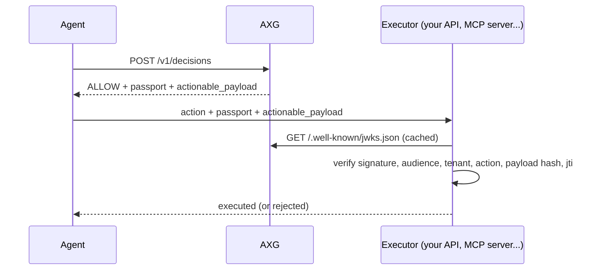

# Passport

A Passport is AXG's proof that an action was authorized. It lets the system that executes an action trust the decision without trusting the agent, the orchestrator or the network in between.

- AXG issues a Passport only for `ALLOW`, only to authenticated callers, and never in shadow mode.
- It is a JWT signed with RS256, valid for 5 minutes, bound to one app, one tenant, one action and one exact payload.
- Verifiers fetch AXG's public keys from `/.well-known/jwks.json` and can enforce single use.



## Claims

| Claim | Meaning |
|---|---|
| `iss` | Always `axg-engine` |
| `aud` | The `app_id` the action is authorized for |
| `sub` | The `execution_id` |
| `iat`, `nbf`, `exp` | Issued at, valid from, expires (5 minutes) |
| `jti` | Unique id, for single-use enforcement. Also returned as `passport_id` and stored in the audit log instead of the token |
| `ver` | `2` |
| `tenant_id` | Tenant the decision was made for |
| `azp` | `client_id` of the caller that requested the decision |
| `decision` | Always `ALLOW` |
| `action_type` | The authorized action |
| `policy` | `plugin@version` that produced the decision |
| `payload_hash` | SHA-256 of the canonical JSON of the `actionable_payload` |

The header carries `kid`, the RFC 7638 thumbprint of the signing key. The claims are published as [`schemas/passport_claims.v2.schema.json`](../schemas/passport_claims.v2.schema.json).

## Execute the actionable payload, not the original request

The Passport authorizes the `actionable_payload` from the response: the request payload, plus the `proposed_action` and any fields that matched rules added. Execute exactly that payload and verify the Passport against it. The hash covers every field, so changing any of them after the decision makes verification fail.

The hash uses canonical JSON in the style of RFC 8785 (sorted keys, no whitespace, ECMAScript number formatting, UTF-8). AXG, the Python SDK and the Node SDK produce the same bytes, checked by shared test vectors.

## Verify in Python

```bash
pip install "axg-python-sdk @ git+https://github.com/pinheirodps/axg#subdirectory=sdks/axg-python-sdk"
```

```python
from axg_python_sdk import AxgVerificationError, InMemoryReplayCache, verify_passport

replay_cache = InMemoryReplayCache()  # use a shared store (Redis SET NX) across replicas

def execute(passport: str, actionable_payload: dict) -> None:
    try:
        claims = verify_passport(
            passport,
            actionable_payload,
            app_id="support",
            tenant_id="acme",
            allowed_action_types=["issue_refund"],
            jwks_url="https://axg.example.com/.well-known/jwks.json",
            replay_cache=replay_cache,
        )
    except AxgVerificationError as exc:
        raise PermissionError(f"Not authorized by AXG: {exc.code}") from exc
    issue_refund(**actionable_payload)
```

In async services, `AxgClient(base_url).verify_passport(...)` keeps a cached JWKS client and runs the key fetch off the event loop.

## Verify in Node

The Node SDK lives in [`sdks/axg-node-sdk`](../sdks/axg-node-sdk). Build it from the repository until it is published to npm.

```ts
import { AxgClient, AxgVerificationError, InMemoryReplayCache } from 'axg-node-sdk';

const axg = new AxgClient('https://axg.example.com/');
const replayCache = new InMemoryReplayCache();

const claims = await axg.verifyPassport(passport, actionablePayload, {
  appId: 'support',
  tenantId: 'acme',
  allowedActionTypes: ['issue_refund'],
  replayCache,
});
```

## Verification failures

| Code | Meaning |
|---|---|
| `JWT_ERROR` | Bad signature, wrong issuer or audience, expired or not yet valid (the Node SDK keeps the `jose` code, such as `ERR_JWT_EXPIRED`) |
| `DECISION_NOT_ALLOWED` | The token does not carry `ALLOW` |
| `TENANT_ID_MISMATCH` | Issued for another tenant |
| `ACTION_TYPE_MISMATCH` | Issued for another action |
| `MISSING_PAYLOAD_HASH`, `PAYLOAD_TAMPERED` | The payload is not the one AXG authorized |
| `MISSING_JTI`, `PASSPORT_REPLAYED` | Replay protection: the token has no `jti`, or was already used |

Treat every failure as "not authorized". Never fall back to executing.

## MCP tools

When an MCP gateway or interceptor asks AXG before forwarding a tool call, it puts the Passport and the authorized payload in the request's `params._meta` under `io.axg/passport` and `io.axg/actionable_payload`. Inside the tool, one call checks that AXG authorized exactly this tool with exactly these arguments:

```python
from axg_python_sdk import verify_mcp_tool_call

claims = verify_mcp_tool_call(
    meta=request.params.meta,
    tool_name="issue_refund",
    arguments=request.params.arguments,
    app_id="support",
    jwks_url="https://axg.example.com/.well-known/jwks.json",
)
```

Node: `verifyMcpToolCall(meta, toolName, args, options, jwksUrl)`. The [AgentCore interceptor](../integrations/agentcore) is a ready-made producer of these fields.

## Key management

- **Production** requires `AXG_PRIVATE_KEY`, an RSA key in PEM (`\n` escapes accepted). With `AXG_ENV=production`, AXG refuses to start without it. Elsewhere it generates an ephemeral key and warns.
- **Rotation without downtime:**
  1. Generate a new key pair.
  2. Set `AXG_PRIVATE_KEY` and `AXG_PUBLIC_KEY` to the new pair, and add the old public key to `AXG_PREVIOUS_PUBLIC_KEYS` (a JSON list of PEM strings).
  3. Deploy. New Passports carry the new `kid`; the JWKS still publishes the old key, so Passports issued before the switch keep verifying.
  4. After the Passport lifetime plus your verifiers' JWKS cache time, remove the old key from `AXG_PREVIOUS_PUBLIC_KEYS`.
- Verifiers select the key by `kid` and refetch the JWKS only when they meet an unknown `kid`.

## Passport v1

Tokens issued before v0.2 (`ver` absent) still verify with the SDKs, using the v1 payload hash. They carry no `jti`, so replay protection rejects them.
