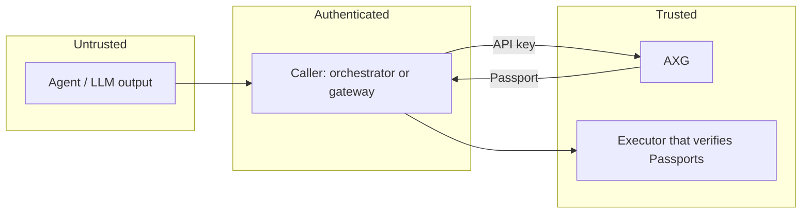

# Security model

AXG exists so that a compromised, confused or manipulated agent cannot turn a bad proposal into an executed action. This page describes what AXG protects, what it trusts, and what it leaves to you. To report a vulnerability, follow [SECURITY.md](../SECURITY.md).

## Trust boundaries

- **The agent is untrusted.** Its proposal (action, payload, claimed confidence) is input to evaluate, never an instruction.
- **The caller is authenticated, not trusted blindly.** It proves its identity with an API key, may act only for its own apps, and can grant its agents at most the permissions its `AXG_CLIENTS` entry allows.
- **The executor trusts only the Passport.** It verifies the signature, audience, tenant, action, payload hash and single use before acting. Anything between AXG and the executor, including the caller, cannot forge or alter an authorization.

## What AXG guarantees

| Threat | Control |
|---|---|
| An agent performs an action it is not permitted to | Required permissions per action, capped by the caller's ceiling; `BLOCK` otherwise |
| Prompt injection turns a request into a dangerous action | Deterministic rules on the concrete action and payload; the model's output never decides |
| A payload is modified after approval (amount, destination, command) | Canonical SHA-256 of the whole actionable payload bound into the Passport |
| An approval is replayed | Passport `jti` with 5-minute validity; SDK replay caches |
| A Passport is used for another app, tenant or action | `aud`, `tenant_id` and `action_type` claims checked by verifiers |
| An anonymous or stolen-network caller obtains authorization | API keys stored as SHA-256; anonymous calls never receive `ALLOW` |
| A caller requests decisions for someone else's app | `app_ids` per caller; `403` otherwise |
| A broken or missing policy lets actions through | Fail-safe `CONFIRM`; unknown rule operators fail validation |
| A malicious remote policy or SSRF through policy loading | Remote policies off by default; HTTPS, exact allow-list, public IPs only, pinned DNS, no redirects |
| An approval is replayed, forged, reused for another payload or granted by the agent itself | Signed tickets bound to the payload hash and policy version; required role, end-user binding and no self-approval; Passport `jti` = ticket id |
| A caller misreports the facts a rule depends on | [Signed context](signed-context.md) from registered providers (asymmetric signatures, audience, freshness, tenant and user binding); `required_context` turns a missing fact into `CONFIRM` |
| Audit records are edited or deleted | Hash-chained audit file, `axg verify-audit` |
| Key compromise or rotation | JWKS with `kid`, retired keys kept during rotation |
| Resource exhaustion | Body size limit and per-caller rate limit |

## What AXG does not do

- **It does not execute actions.** Enforcement depends on executors verifying Passports. An executor that skips verification is outside AXG's protection.
- **It does not judge facts it is not given.** Rules see the request. Facts in `context` are the caller's word. For facts a caller could misreport (balances, limits, account status), have the owning service sign them as [signed context](signed-context.md) and declare `required_context`. AXG then proves who vouched for a fact, but not that the fact is true.
- **AXG does not run the approval queue or authenticate humans.** `CONFIRM` and `SUGGEST` carry a signed ticket, and AXG checks the approver's role, the payload and the policy before issuing a Passport. The application stores tickets, authenticates the approver and asserts their role (see [Human approvals](approvals.md)).
- **It does not replace transport security.** Run AXG on a private network or behind TLS. API keys are bearer credentials.

## Operational guidance

- Give each caller its own key, the narrowest `app_ids` and the smallest permissions ceiling. Rotate keys by adding the new hash, migrating the caller, then removing the old hash.
- Keep `AXG_PRIVATE_KEY` in a secret store, and rotate it with `AXG_PREVIOUS_PUBLIC_KEYS` (see [Passport](passport.md#key-management)).
- Treat policies as code: review, version, validate in CI, and trial in shadow mode.
- Share the replay cache across executor replicas (for example Redis `SET NX` with the Passport expiry).
- Monitor `BLOCK` rates and `ERROR` spans; a spike is either an attack or a broken policy.

## Supply chain

Dependencies and GitHub Actions are pinned (actions by commit SHA) and kept current by Dependabot. CI runs `pip-audit`, `npm audit` and a check for vulnerable .NET packages. Images are built from a digest-pinned base, run as a non-root user, and are published with an SBOM and provenance attestations.
