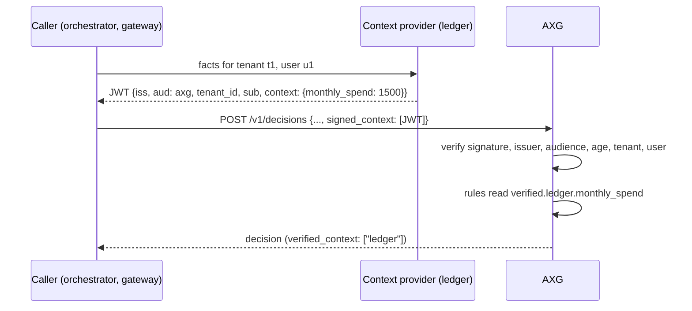

# Signed context

Rules are only as good as the facts they read. A request's `context` is whatever the caller reports, so a rule like "block payments once the monthly spend passes 1,000" can be defeated by a caller that reports a lower number, or by an agent that talks its orchestrator into doing so.

**Signed context** moves that trust to the service that owns the fact. The ledger, the KYC service or the account system signs the facts it knows as a short-lived JWT. The caller forwards the token, and AXG verifies it before any rule runs. Rules read verified facts under `verified.<provider>.<fact>`, a namespace that only checked signatures can fill.



The pattern is close to [OAuth transaction tokens](https://datatracker.ietf.org/doc/draft-ietf-oauth-transaction-tokens/): a trusted service asserts context about one transaction, with a short lifetime, and every hop can verify it without trusting the hop before.

## 1. Register the provider

AXG trusts only the providers you list in `AXG_CONTEXT_PROVIDERS`:

```json
[
  {"id": "ledger", "issuer": "https://ledger.internal", "jwks_url": "https://ledger.internal/.well-known/jwks.json", "max_age_seconds": 300},
  {"id": "kyc", "issuer": "https://kyc.internal", "public_key": "-----BEGIN PUBLIC KEY-----\n..."}
]
```

| Field | Required | Meaning |
|---|---|---|
| `id` | yes | Name used in policies (`verified.<id>.…`, `required_context`). Lowercase letters, digits, `_` and `-` |
| `issuer` | yes | Exact `iss` of the provider's tokens; identifies the provider |
| `jwks_url` or `public_key` | one of them | Where the verification key comes from. A JWKS is cached for five minutes and supports key rotation |
| `max_age_seconds` | no | How old a token may be (from `iat`), default 300, at most 86400 |

`AXG_CONTEXT_AUDIENCE` sets the expected `aud` (default `axg`). Give each AXG deployment its own audience if tokens must not be reusable between them.

## 2. Sign facts in the provider

A context token is a JWT signed with an asymmetric algorithm (`RS256`, `PS256`, `ES256` or `EdDSA`). Shared secrets (`HS256`) are refused, so no one who can verify tokens can mint them.

| Claim | Required | Meaning |
|---|---|---|
| `iss` | yes | The provider's `issuer` |
| `aud` | yes | `axg`, or your `AXG_CONTEXT_AUDIENCE` |
| `iat`, `exp` | yes | Issue and expiry times. Keep the lifetime short: minutes, not hours |
| `tenant_id` | yes | Must equal the request's `tenant_id` |
| `sub` | no | The end user. When present, it must equal the request's `user_id` |
| `context` | yes | A JSON object with the facts |

Python (PyJWT):

```python
import time, jwt

now = int(time.time())
token = jwt.encode(
    {"iss": "https://ledger.internal", "aud": "axg", "iat": now, "exp": now + 120,
     "tenant_id": tenant_id, "sub": user_id, "context": {"monthly_spend": 1500, "currency": "EUR"}},
    LEDGER_PRIVATE_KEY, algorithm="ES256", headers={"kid": LEDGER_KEY_ID},
)
```

Node (jose):

```ts
import { SignJWT } from 'jose';

const token = await new SignJWT({ tenant_id: tenantId, context: { monthly_spend: 1500, currency: 'EUR' } })
  .setProtectedHeader({ alg: 'ES256', kid: LEDGER_KEY_ID })
  .setIssuer('https://ledger.internal').setAudience('axg').setSubject(userId)
  .setIssuedAt().setExpirationTime('2m')
  .sign(ledgerPrivateKey);
```

## 3. Send it with the decision

```json
{
  "execution_id": "pay-1",
  "tenant_id": "t1",
  "user_id": "u1",
  "action_type": "pay",
  "payload": {"amount": 40, "currency": "EUR"},
  "signed_context": ["eyJhbGciOiJFUzI1NiIsImtpZCI6..."]
}
```

Up to eight tokens per request, at most one per provider. The response lists the providers whose tokens were verified in `verified_context`, and so does the audit record.

## 4. Use verified facts in policies

```json
{
  "actions": {
    "pay": {"required_permissions": ["payments:write"], "required_context": ["ledger"]}
  },
  "rules": [
    {
      "id": "monthly_limit",
      "description": "Verified monthly spend above the limit",
      "condition": {"all": [{"field": "verified.ledger.monthly_spend", "operator": "gt", "value": 1000}]},
      "decision": "BLOCK",
      "reason": "The monthly spending limit has been reached."
    }
  ]
}
```

Declare `required_context` whenever a rule depends on verified facts. A condition on a missing field never matches, so without the requirement a request that simply leaves out its token would skip the rule. With it, a missing or invalid token turns `ALLOW` or `SUGGEST` into `CONFIRM` (flag `verified_context_missing`), and a human decides with an [approval](approvals.md). It never lowers a `BLOCK`.

## What AXG checks

| Check | Rejected when |
|---|---|
| Issuer | `iss` is not a configured provider |
| Signature | Not signed by the provider's key, or signed with a symmetric algorithm |
| Audience | `aud` is not `AXG_CONTEXT_AUDIENCE` |
| Freshness | Expired, or issued longer ago than `max_age_seconds` (30 s clock leeway) |
| Binding | Another `tenant_id`, or a `sub` that is not the request's `user_id` |
| Shape | A required claim is missing, or `context` is not an object |
| Uniqueness | A second token from the same provider in one request |

A rejected token is ignored and the decision carries the flag `signed_context_rejected`. The reason is logged by AXG, never returned to the caller. If `AXG_CONTEXT_PROVIDERS` is malformed, AXG logs the error and verifies nothing, so required context stays missing and the affected actions need confirmation.

## Limits

- **Freshness, not single use.** A token can be reused within its lifetime, for the same tenant and user. Keep lifetimes short for facts that change quickly.
- **The provider is trusted for what it signs.** AXG proves who vouched for a fact, not that the fact is true. Register only services that own the data.
- **`context` is still available** for facts where the caller's word is enough. Rules choose which namespace to trust.
